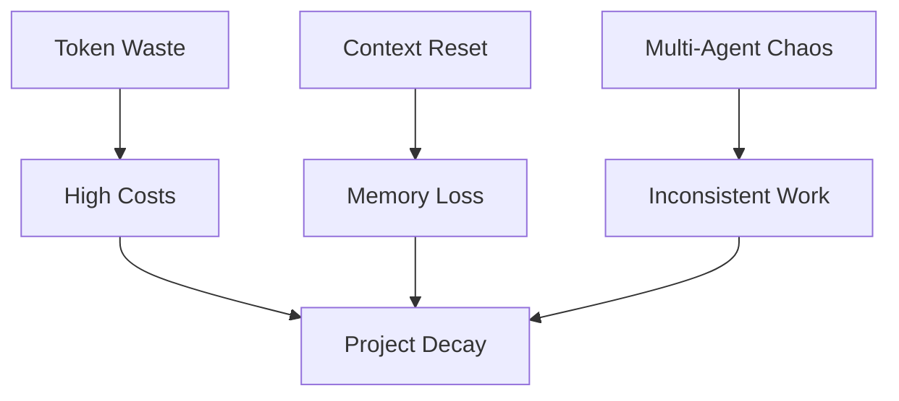
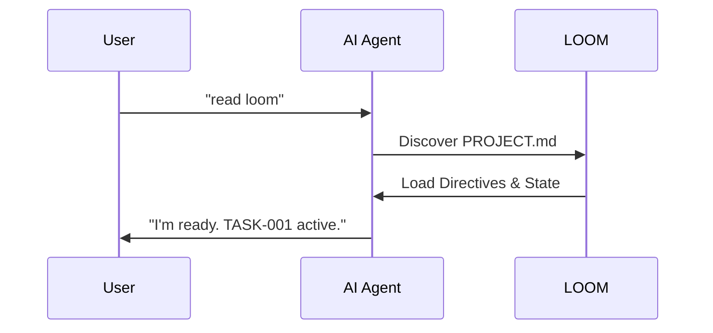
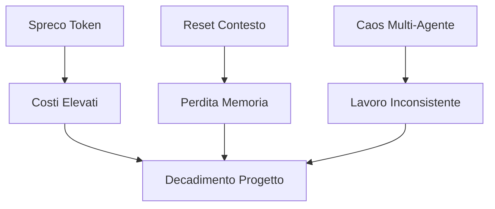
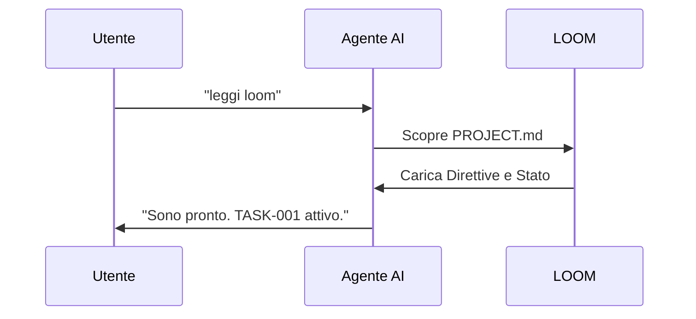

# LOOM — Abstract

> **The operational framework that makes AI agents reliable, persistent, and token-efficient**

---

## 🇬🇧 English

## ❌ The Problem: The Triple Crisis of AI Development



### 1. Context Window Limitations
AI agents suffer from "short-term memory." As a conversation grows, the agent begins to lose track of early project decisions, resulting in hallucinations or conflicting code.

### 2. Multi-Agent & Multi-IDE Chaos
The mental model of the AI is trapped inside a single chat thread. When a developer switches from **Windsurf** to **Cursor**, or from **Claude Code** to **VS Code Insider**, the new agent starts with zero project context. This lack of continuity forces the developer to re-explain everything.

### 3. Token Waste & Probabilistic Failures
In complex tasks, a 90% success rate per step sounds good, but over a 10-step sequence, the probability of success drops to ~35% ($0.9^{10}$). Without deterministic guidance, agents iterate blindly, wasting thousands of tokens on failed attempts.

---

## ✅ The Solution: LOOM

LOOM provides a structured, file-based memory that stays with your project.



LOOM solves these problems through **persistent file-based memory** and a **deterministic 3-level architecture**:

#### 1. Persistent Memory (Beats Context Limits)
- **TASKS.md** — Active work tracking that survives context resets
- **STORY.md** — Operational history across all sessions
- **AGENT.md** — Single source of truth for project context
- **CHANGELOG.md** — Automatic versioning and change tracking

These files create a **shared memory layer** that:
- Survives context window resets
- Works across different IDEs and agents
- Enables seamless handoffs between sessions
- Maintains project continuity indefinitely

#### 2. Multi-IDE & Multi-Agent Support
- **7 IDE configs** kept in sync automatically
- Same workflow in Cursor, Windsurf, Claude Code, VS Code, IntelliJ, loom (IDE), VS Code Insider
- Agents read the same files regardless of IDE
- Switch tools without losing context

#### 3. Token-Efficient Deterministic Framework
- **Directives** (Level 1): SOPs in natural language — what to do
- **Orchestration** (Level 2): Agent makes decisions — how to decide
- **Execution** (Level 3): Python scripts do the work — deterministic

**Token savings**: Instead of prompting "how to send email" every time, the agent:
1. Reads `directives/send-email.md` once (cached)
2. Calls `execution/send_email.py` (deterministic, no tokens)
3. Gets JSON result (structured, minimal tokens)

**Result**: 90% accuracy maintained over 10+ steps instead of degrading to 35%.

#### 4. Self-Improving Agents
- Agents write new directives as they learn
- Scripts get reused across sessions
- Framework improves with every project
- Knowledge compounds instead of resetting

### Zero-Friction Setup

No commands to remember. Just:

```
1. Create your project folder
2. Add PROJECT.md with project description
3. Put loom/ folder in your project
4. Open any IDE and say: "read loom"
```

That's it. LOOM auto-configures everything.

### Key Benefits

- ✅ **Persistent**: Survives context resets and session changes
- ✅ **Multi-Agent**: Works across IDEs and AI tools
- ✅ **Token-Efficient**: Reuses knowledge, minimizes repetition
- ✅ **Deterministic**: Scripts replace probabilistic prompts
- ✅ **Self-Improving**: Agents learn and compound knowledge
- ✅ **Zero-Friction**: Natural language setup, no commands

---

## 🇮🇹 Italiano

## ❌ Il Problema: La Tripla Crisi dello Sviluppo AI



### 1. Limiti della Context Window
Gli agenti AI soffrono di "memoria a breve termine". Man mano che una conversazione cresce, l'agente inizia a perdere traccia delle decisioni iniziali, producendo allucinazioni o codice conflittuale.

### 2. Caos Multi-Agente & Multi-IDE
Il modello mentale dell'AI è intrappolato in un singolo thread di chat. Quando uno sviluppatore passa da **Windsurf** a **Cursor**, o da **Claude Code** a **VS Code Insider**, il nuovo agente parte da zero. Questa mancanza di continuità costringe lo sviluppatore a rispiegare tutto ogni volta.

### 3. Spreco di Token e Fallimenti Probabilistici
In compiti complessi, un tasso di successo del 90% per step sembra buono, ma su una sequenza di 10 step, la probabilità di successo scende al ~35% ($0.9^{10}$). Senza una guida deterministica, gli agenti iterano alla cieca, sprecando migliaia di token in tentativi falliti.

---

## ✅ La Soluzione: LOOM

LOOM fornisce una memoria strutturata basata su file che rimane con il tuo progetto.



LOOM risolve questi problemi attraverso **memoria persistente basata su file** e un'**architettura deterministica a 3 livelli**:

#### 1. Memoria Persistente (Supera i Limiti di Contesto)
- **TASKS.md** — Tracciamento lavoro che sopravvive ai reset
- **STORY.md** — Storia operativa attraverso tutte le sessioni
- **AGENT.md** — Unica fonte di verità per il contesto del progetto
- **CHANGELOG.md** — Versioning e tracking automatico delle modifiche

Questi file creano un **layer di memoria condivisa** che:
- Sopravvive ai reset della finestra di contesto
- Funziona tra IDE e agenti diversi
- Abilita passaggi fluidi tra sessioni
- Mantiene la continuità del progetto indefinitamente

#### 2. Supporto Multi-IDE & Multi-Agente
- **7 config IDE** mantenute sincronizzate automaticamente
- Stesso workflow in Cursor, Windsurf, Claude Code, VS Code, IntelliJ, loom (IDE), VS Code Insider
- Gli agenti leggono gli stessi file indipendentemente dall'IDE
- Cambia strumenti senza perdere contesto

#### 3. Framework Deterministico Token-Efficient
- **Direttive** (Livello 1): SOP in linguaggio naturale — cosa fare
- **Orchestrazione** (Livello 2): L'agente decide — come decidere
- **Esecuzione** (Livello 3): Script Python fanno il lavoro — deterministico

**Risparmio token**: Invece di chiedere "come inviare email" ogni volta, l'agente:
1. Legge `directives/send-email.md` una volta (cached)
2. Chiama `execution/send_email.py` (deterministico, zero token)
3. Ottiene risultato JSON (strutturato, token minimi)

**Risultato**: 90% di accuratezza mantenuta su 10+ step invece di degradare al 35%.

#### 4. Agenti Auto-Miglioranti
- Gli agenti scrivono nuove direttive mentre imparano
- Gli script vengono riutilizzati tra sessioni
- Il framework migliora con ogni progetto
- La conoscenza si accumula invece di resettarsi

### Setup Zero-Friction

Nessun comando da ricordare. Semplicemente:

```
1. Crea la cartella del tuo progetto
2. Aggiungi PROJECT.md con la descrizione del progetto
3. Metti la cartella loom/ nel tuo progetto
4. Apri qualsiasi IDE e di': "leggi loom"
```

Tutto qui. LOOM auto-configura tutto.

### Benefici Chiave

- ✅ **Persistente**: Sopravvive a reset di contesto e cambi di sessione
- ✅ **Multi-Agente**: Funziona tra IDE e strumenti AI
- ✅ **Token-Efficient**: Riusa conoscenza, minimizza ripetizioni
- ✅ **Deterministico**: Script sostituiscono prompt probabilistici
- ✅ **Auto-Migliorante**: Gli agenti imparano e accumulano conoscenza
- ✅ **Zero-Friction**: Setup in linguaggio naturale, nessun comando

---

**Version**: 1.0.0  
**Author**: Andrea Mazzarotto  
**License**: MIT
