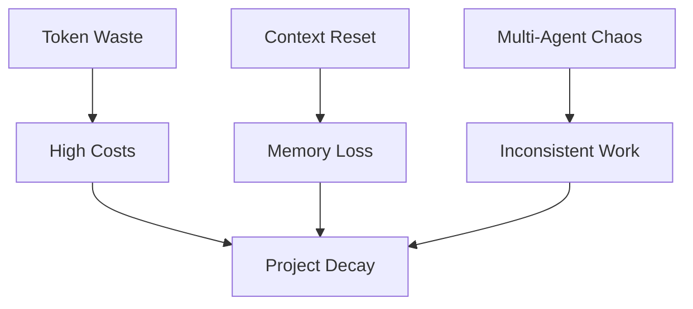
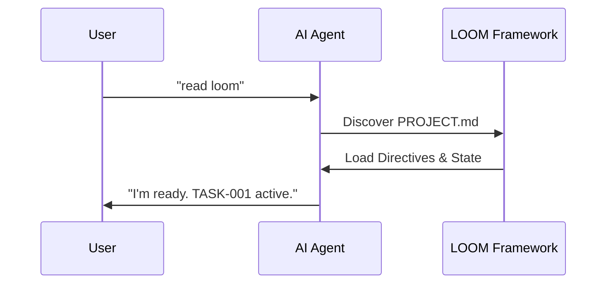

# <div align="center">🧵 LOOM Framework 🧵</div>

<div align="center">

> **Weave intelligent agents into your development workflow**  
> **Integra agenti intelligenti nel tuo workflow di sviluppo**

[](https://opensource.org/licenses/MIT)
[](https://github.com/otto78/loom-framework/releases)
[](https://www.python.org/)
[](#-supported-ides)
[](https://github.com/otto78/loom-framework)

**🌐 [🇬🇧 English](#-the-problem) | [🇮🇹 Italiano](#-italiano--versione-italiana)**

---

## **[📥 Download LOOM Framework](https://github.com/otto78/loom-framework/releases/latest/download/loom-framework.zip)**

### *Scarica → Estrai nella cartella del tuo progetto → Crea PROJECT.md → Di' "read loom"*

[](https://github.com/otto78/loom-framework/releases/latest/download/loom-framework.zip)

</div>

---

A complete operational framework for AI-powered development across multiple IDEs. LOOM provides structure, automation, and best practices for teams working with AI agents.

---

## ❌ The Problem

Current AI-assisted development is hindered by:



1.  **Context Window Limitations**: Agents "forget" project context when history gets too long.
2.  **Multi-Agent Fragmentation**: Moving from Windsurf to Cursor or Claude Code resets the agent's mental model.
3.  **Token Waste**: Re-explaining the project in every prompt consumes thousands of tokens.

---

## ✅ The Solution: Persistent File-Based Memory

LOOM provides a structured, file-based memory that stays with your project.



- 🧠 **Persistent Memory** — TASKS.md, STORY.md survive context resets
- 🔄 **Multi-Agent Support** — Same state across 7 IDEs
- 💰 **Token Savings** — Scripts replace repetitive prompts
- 🎯 **Deterministic** — 90% accuracy maintained over 10+ steps
- 🚀 **Zero-Friction** — Just say "read loom"

---

## 📂 What Gets Created in Your Project

After running `python loom/scripts/setup.py` in your project, loom creates:

```
your-project/
├── AGENT.md                  # ⭐ Source of truth — project context for every agent session
├── .windsurfrules            # IDE config (only for selected IDEs)
├── .cursorrules              #
├── CLAUDE.md                 #
├── LOOM.md            #
├── .clinerules               #
├── .idea/
│   └── LOOM.md  # IntelliJ config
└── docs/
    ├── TASKS.md              # Active task tracking
    ├── BACKLOG.md            # Future ideas
    ├── STORY.md              # Operational history (auto-updated)
    ├── CHANGELOG.md          # Version changelog (auto-updated)
    └── HANDOFF.md            # Agent handoff protocol
```

**Your existing files are never overwritten.** loom only creates files that don't exist yet.

---

## 🎯 What is LOOM?

LOOM is an operational framework that brings structure to AI-assisted development. It provides:

- ⚡ **Quick Setup** — Interactive wizard + automated scripts
- 🤖 **Multi-IDE Support** — 7 IDEs (Windsurf, Claude Code, Cursor, Antigravity, VS Code, IntelliJ IDEA, GitHub Copilot)
- 📋 **Task Management** — Complete system with TASKS.md + BACKLOG.md
- 🧪 **TDD Workflow** — Test-Driven Development integrated
- 📝 **Integrated Versioning** — Automatic STORY.md + CHANGELOG.md
- 🔄 **Automated Workflow** — Python scripts for complete task lifecycle
- 📚 **DOE Architecture** — Directives / Orchestration / Execution
- 🔀 **Handoff Protocol** — Seamless agent-to-agent transitions
- 🧩 **Adaptable** — Works with new and existing projects

---

## 🚀 Quick Start

### **Method 1: Download ZIP (Recommended)** 🎁

**The fastest way to get started — takes 2 minutes:**

1. **[📥 Download `loom-framework.zip`](https://github.com/otto78/loom-framework/releases/latest/download/loom-framework.zip)** ← Click here
2. **Extract** the ZIP into your project folder (creates `loom/` folder + files)
3. **Create** `PROJECT.md` in your project root — describe your project in a few sentences
4. **Open any IDE** (Windsurf, Cursor, Claude, etc.) and say: **"read loom"**
5. **Done!** LOOM auto-configures everything and starts working

**What you get in the ZIP:**
- `loom/` — Framework folder with all scripts and templates
- `setup.py` — Interactive setup wizard
- `docs/` — Templates for TASKS.md, STORY.md, CHANGELOG.md
- IDE configs for all 7 supported IDEs

See **[QUICKSTART.md](./QUICKSTART.md)** for complete instructions and troubleshooting.

---

### Method 2: Clone from GitHub

**For new projects (4 steps):**

1. Clone repository
2. Create `PROJECT.md` with project description
3. Add `loom/` folder to your project
4. Open any IDE and say: **"read loom"**

**For existing projects (2 steps):**

1. Add `loom/` folder to your project
2. Open any IDE and say: **"read loom"**

**That's it!** No commands to remember.

---

### Method 3: One-Liner Install

**Windows (PowerShell):**
```powershell
irm https://raw.githubusercontent.com/otto78/loom-framework/main/install.ps1 | iex
```

**Unix/Linux/macOS:**
```bash
curl -fsSL https://raw.githubusercontent.com/otto78/loom-framework/main/install.sh | bash
```

---

## 📋 Natural Language Commands

After setup, use natural language with your AI agent:

```
"start task TASK-001 'implement feature X'"
"list tasks"
"run tests"
"complete task TASK-001"
"sync configs"
```

No need to remember Python script paths or command syntax!

---

## 🏗️ The DOE Architecture

**DOE = Directives / Orchestration / Execution**

A 3-layer architecture that solves the fundamental problem of AI agents: **probabilistic degradation**. Each decision an LLM makes has ~90% accuracy. Over 10 steps, accuracy drops to 35% ($0.9^{10}$). DOE solves this by pushing complexity into deterministic code.

```
┌─────────────────────────────────────────────────────────────┐
│ Level 1: DIRECTIVES (What to do)                           │
│ loom/directives/*.md — SOPs in natural language            │
│ • Objectives, inputs, outputs defined in plain English      │
│ • Agent reads once, cached for entire session               │
│ • Example: "Send welcome email to new user"                 │
├─────────────────────────────────────────────────────────────┤
│ Level 2: ORCHESTRATION (How to decide)                     │
│ Agent makes high-level decisions                            │
│ • Chooses which directive to apply                            │
│ • Determines parameters                                     │
│ • Routes to appropriate execution script                    │
│ • This is where the LLM thinks, not where it works          │
├─────────────────────────────────────────────────────────────┤
│ Level 3: EXECUTION (Do the work) — 100% Deterministic      │
│ loom/execution/*.py — Python scripts that never hallucinate │
│ • Send the actual HTTP request                                │
│ • Write the actual file to disk                               │
│ • Make the actual Git commit                                  │
│ • Zero tokens, zero probability of error                      │
└─────────────────────────────────────────────────────────────┘
```

**Real Example: Sending an Email**

| Step | Traditional AI | DOE Approach |
|------|---------------|--------------|
| 1 | Ask LLM "send email" → 90% accurate | Agent reads `directives/send-email.md` once |
| 2 | LLM writes code → 90% accurate | Agent decides to call `execution/send_email.py` |
| 3 | LLM executes code → 90% accurate | **Script executes deterministically** — 100% |
| **Result** | 72% success (0.9³) | 90% success (LLM only makes 1 decision) |

**Why it works**: Every line of code an LLM might write is replaced by pre-tested Python. The agent makes decisions; scripts do the work. Token usage drops 80%, accuracy stays high across long workflows.

---

## 📁 Structure

```
loom-framework/
├── README.md                          # This guide
├── docs/
│   ├── setup-guide.md                 # Complete setup guide
│   ├── workflow-guide.md              # Task workflow guide
│   ├── framework-guide.md             # DOE Architecture
│   └── templates/                     # Documentation templates
│       ├── TASKS.md                   # Task tracking
│       ├── BACKLOG.md                 # Future ideas
│       ├── STORY.md                   # Operational history
│       ├── CHANGELOG.md               # Detailed changelog
│       └── HANDOFF.md                 # Handoff protocol
│
├── loom/
│   ├── scripts/                       # Automation scripts
│   │   ├── task.py                    # Task workflow manager ⭐
│   │   ├── task-tdd.py                # TDD workflow ⭐
│   │   ├── setup.py                   # Interactive wizard ⭐
│   │   ├── init-project.sh            # Init Unix/Linux/macOS
│   │   ├── init-project.ps1           # Init Windows
│   │   └── sync-configs.sh            # Sync IDE configs
│   │
│   ├── templates/                     # Core templates
│   │   ├── AGENT.md.template          # Project source of truth
│   │   ├── 3-level-framework.md       # Architecture details
│   │   └── coding-standards.md        # Code standards
│   │
│   ├── ide-configs/                   # IDE configurations
│   │   ├── windsurf/                  # .windsurfrules
│   │   ├── claude/                    # CLAUDE.md
│   │   ├── cursor/                    # .cursorrules
│   │   ├── loom/               # LOOM template
│   │   ├── vscode/                    # .clinerules
│   │   ├── VS Code Insider/                   # VS Code Insider-instructions.md
│   │   └── intellij/                  # LOOM.md
│   │
│   ├── directives/                    # SOPs (Standard Operating Procedures)
│   │   ├── README.md                  # How to write directives
│   │   ├── _template.md               # Template for new directives
│   │   └── coding-standards.md        # Shared standards
│   │
│   └── execution/                     # Deterministic scripts
│       ├── README.md                  # Execution conventions
│       └── _template.py               # Template for new scripts
│
├── examples/                          # Example projects
└── tests/                             # Framework tests
```

---

## 🔄 Task Workflow

### Normal Workflow

```bash
# Initialize system (first time)
python loom/scripts/task.py init

# Start new task
python loom/scripts/task.py start TASK-001 "Implement feature X"

# List active tasks
python loom/scripts/task.py list

# Complete task
python loom/scripts/task.py complete TASK-001 "Feature X implemented" --bump minor
```

### TDD Workflow

```bash
# Start TDD task (create tests first)
python loom/scripts/task-tdd.py start TASK-001 "Add email validation"

# Write tests (should fail - Red phase)
# Implement feature (tests pass - Green phase)

# Run tests
python loom/scripts/task-tdd.py test

# Complete task (only if tests pass)
python loom/scripts/task-tdd.py complete TASK-001
```

---

## 🎨 Supported IDEs

| IDE/Tool | Config File | Location |
|----------|-------------|----------|
| 🌊 Windsurf | `.windsurfrules` | Root |
| 🎯 Claude Code | `CLAUDE.md` | Root |
| ⚡ Cursor | `.cursorrules` | Root |
| 🚀 Antigravity | `ANTIGRAVITY.md` | Root |
| 💻 VS Code + Cline | `.clinerules` | Root |
| 💡 IntelliJ IDEA | `LOOM.md` | `.idea/` |
| 🤖 GitHub Copilot | `copilot-instructions.md` | `.github/` |

---

## 📚 Documentation

- **[QUICKSTART.md](./QUICKSTART.md)** — 5-minute quick start
- **[guides/NATURAL-LANGUAGE-GUIDE.md](./guides/NATURAL-LANGUAGE-GUIDE.md)** — Use framework by talking
- **[guides/ABSTRACT.md](./guides/ABSTRACT.md)** — Core concepts (bilingual)
- **[guides/TDD-WORKFLOW.md](./guides/TDD-WORKFLOW.md)** — Test-Driven Development guide
- **[guides/MONOREPO-GUIDE.md](./guides/MONOREPO-GUIDE.md)** — Using LOOM in monorepos
- **[guides/SETUP-INSTRUCTIONS.md](./guides/SETUP-INSTRUCTIONS.md)** — For AI agents
- **[docs/framework-guide.md](./docs/framework-guide.md)** — 3-level architecture
- **[docs/workflow-guide.md](./docs/workflow-guide.md)** — Complete workflow guide

---

## 🌟 Why LOOM?

### Before LOOM
- ❌ Inconsistent AI agent behavior
- ❌ No task tracking
- ❌ Manual documentation updates
- ❌ Lost context between sessions
- ❌ No testing workflow

### After LOOM
- ✅ Structured agent workflows
- ✅ Automatic task management
- ✅ Auto-updated documentation
- ✅ Seamless handoffs
- ✅ Integrated TDD workflow

---

## 🆚 Why Not X?

### vs. Cursor Rules / `.cursorrules`
Cursor rules are a single config file for one IDE. LOOM is a full workflow system: task tracking, versioning, TDD, handoffs, and configs for 7 IDEs — all kept in sync.

### vs. aider
aider is a CLI coding assistant. LOOM is not a coding tool — it's the **operational layer** that sits on top of any AI agent (including aider). You can use aider inside a loom-managed project.

### vs. VS Code Insider Instructions / `CLAUDE.md` alone
Dropping a single instruction file in your repo gives the agent context, but no structure. LOOM adds task lifecycle management, TDD workflow, automated versioning, and agent-to-agent handoff protocol on top.

### vs. writing your own system prompt
Custom prompts work for one agent, one session. LOOM is persistent, multi-agent, multi-IDE, and version-controlled. It survives context resets and team handoffs.

### vs. doing nothing
LLMs are probabilistic. Without structure, accuracy degrades with every chained decision. LOOM pushes complexity into deterministic scripts so agents only make decisions — not do the work.

---

## 🤝 Contributing

See **[guides/CONTRIBUTING.md](./guides/CONTRIBUTING.md)** for guidelines.

---

## 📝 License

MIT — Use, modify, share freely.

---

## 🔗 Links

- **Website**: [otto78.github.io/loom-framework](https://otto78.github.io/loom-framework)
- **Documentation**: [otto78.github.io/loom-framework/docs.html](https://otto78.github.io/loom-framework/docs.html)
- **GitHub**: [github.com/otto78/loom-framework](https://github.com/otto78/loom-framework)
- **Issues**: [github.com/otto78/loom-framework/issues](https://github.com/otto78/loom-framework/issues)

---

**Version**: 1.0.0  
**Author**: Andrea Mazzarotto  
**Tagline**: Weave intelligent agents into your development workflow 🧵

---

## 🇮🇹 Italiano — Versione Italiana

> Framework operativo completo per lo sviluppo AI su più IDE. loom fornisce struttura, automazione e best practice per chi lavora con agenti AI.

### ❌ Il Problema

Lo sviluppo assistito da AI è frenato da:

1. **Limiti della Context Window** — Gli agenti "dimenticano" il contesto del progetto quando la storia diventa troppo lunga.
2. **Frammentazione Multi-Agente** — Passare da Windsurf a Cursor o Claude Code azzera il modello mentale dell'agente.
3. **Spreco di Token** — Rispiegare il progetto in ogni prompt consuma migliaia di token.

**La matematica**: 90% di accuratezza per step = 59% su 5 step = 35% su 10 step.

### ✅ La Soluzione: Memoria Persistente su File

loom fornisce una memoria strutturata basata su file che rimane con il tuo progetto:

- 🧠 **Memoria Persistente** — TASKS.md, STORY.md sopravvivono ai reset di contesto
- 🔄 **Supporto Multi-Agente** — Stesso stato tra 7 IDE
- 💰 **Risparmio Token** — Script sostituiscono prompt ripetitivi
- 🎯 **Deterministico** — 90% di accuratezza mantenuta su 10+ step
- 🚀 **Zero-Friction** — Basta dire "leggi loom"

### 🚀 Avvio Rapido

**Per nuovi progetti (4 step):**

```
1. Crea cartella progetto
2. Crea PROJECT.md con descrizione progetto
3. Aggiungi cartella loom/ al progetto
4. Apri qualsiasi IDE e di': "leggi loom"
```

**Per progetti esistenti (2 step):**

```
1. Aggiungi cartella loom/ al progetto
2. Apri qualsiasi IDE e di': "leggi loom"
```

Per dettagli: **[QUICKSTART.md](./QUICKSTART.md)** o **[guides/ABSTRACT.md](./guides/ABSTRACT.md)** per i concetti

### 🏗️ L'Architettura DOE

**DOE = Direttive / Orchestrazione / Esecuzione**

Un'architettura a 3 livelli che risolve il problema fondamentale degli agenti AI: **il degrado probabilistico**. Ogni decisione di un LLM ha ~90% di accuratezza. Su 10 step, l'accuratezza scende al 35% ($0.9^{10}$). DOE risolve spingendo la complessità nel codice deterministico.

```
┌─────────────────────────────────────────────────────────────┐
│ Livello 1: DIRETTIVE (Cosa fare)                           │
│ loom/directives/*.md — SOP in linguaggio naturale           │
│ • Obiettivi, input, output definiti in italiano/inglese    │
│ • Agente legge una volta, cached per tutta la sessione    │
│ • Esempio: "Invia email di benvenuto al nuovo utente"     │
├─────────────────────────────────────────────────────────────┤
│ Livello 2: ORCHESTRAZIONE (Come decidere)                  │
│ Agente prende decisioni ad alto livello                     │
│ • Sceglie quale direttiva applicare                        │
│ • Determina i parametri                                     │
│ • Indirizza allo script di esecuzione appropriato          │
│ • Qui l'LLM pensa, non qui lavora                           │
├─────────────────────────────────────────────────────────────┤
│ Livello 3: ESECUZIONE (Fare il lavoro) — 100% Deterministico │
│ loom/execution/*.py — Script Python che non allucinano      │
│ • Invia la richiesta HTTP reale                             │
│ • Scrive il file effettivo su disco                         │
│ • Fa il commit Git effettivo                                │
│ • Zero token, zero probabilità di errore                  │
└─────────────────────────────────────────────────────────────┘
```

**Esempio Reale: Inviare una Email**

| Step | AI Tradizionale | Approccio DOE |
|------|-----------------|---------------|
| 1 | Chiedi LLM "invia email" → 90% accurato | Agente legge `directives/send-email.md` una volta |
| 2 | LLM scrive codice → 90% accurato | Agente decide di chiamare `execution/send_email.py` |
| 3 | LLM esegue codice → 90% accurato | **Script esegue deterministicamente** — 100% |
| **Risultato** | 72% successo (0.9³) | 90% successo (LLM fa solo 1 decisione) |

**Perché funziona**: Ogni riga di codice che un LLM potrebbe scrivere è sostituita da Python pre-testato. L'agente prende decisioni; gli script fanno il lavoro. Uso dei token cala dell'80%, l'accuratezza resta alta su workflow lunghi.

### 💬 Comandi in Linguaggio Naturale

Dopo il setup, parla con il tuo agente AI:

```
"avvia task TASK-001 'implementa feature X'"
"mostra i task"
"esegui i test"
"completa task TASK-001"
"sincronizza configurazioni"
```

### 🎨 IDE Supportati

| IDE/Tool | File di Config | Posizione |
|----------|---------------|----------|
| 🌊 Windsurf | `.windsurfrules` | Root |
| 🎯 Claude Code | `CLAUDE.md` | Root |
| ⚡ Cursor | `.cursorrules` | Root |
| 🚀 Antigravity | `ANTIGRAVITY.md` | Root |
| 💻 VS Code + Cline | `.clinerules` | Root |
| 💡 IntelliJ IDEA | `LOOM.md` | `.idea/` |
| 🤖 GitHub Copilot | `copilot-instructions.md` | `.github/` |

### 📚 Documentazione (Italiano)

- **[QUICKSTART.md](./QUICKSTART.md)** — Avvio rapido bilingue
- **[guides/NATURAL-LANGUAGE-GUIDE.md](./guides/NATURAL-LANGUAGE-GUIDE.md)** — Guida comandi bilingue
- **[guides/ABSTRACT.md](./guides/ABSTRACT.md)** — Concetti fondamentali (bilingue)
- **[guides/TDD-WORKFLOW.md](./guides/TDD-WORKFLOW.md)** — Workflow TDD
- **[guides/MONOREPO-GUIDE.md](./guides/MONOREPO-GUIDE.md)** — Gestione monorepo
- **[guides/SETUP-INSTRUCTIONS.md](./guides/SETUP-INSTRUCTIONS.md)** — Per agenti AI (bilingue)

---

**Versione**: 1.0.0  
**Autore**: Andrea Mazzarotto  
**Tagline**: Integra agenti intelligenti nel tuo workflow di sviluppo 🧵

