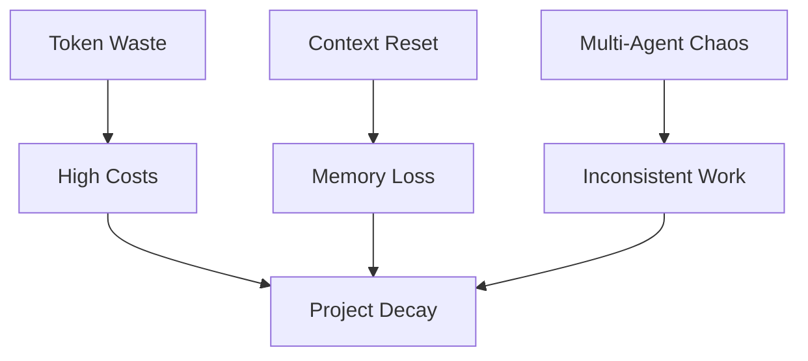
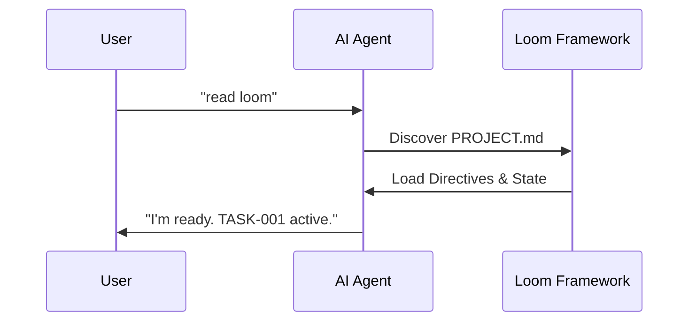

# Loom Framework 🧵

> **Weave intelligent agents into your development workflow**  
> **Integra agenti intelligenti nel tuo workflow di sviluppo**

🌐 **Language / Lingua**: [🇬🇧 English](#-the-problem) | [🇮🇹 Italiano](#-italiano--versione-italiana)

[](https://opensource.org/licenses/MIT)
[](https://github.com/otto78/loom-framework/releases)
[](https://www.python.org/)
[](#-supported-ides)
[](https://github.com/otto78/loom-framework)

A complete operational framework for AI-powered development across multiple IDEs. Loom provides structure, automation, and best practices for teams working with AI agents.

---

## ❌ The Problem

Current AI-assisted development is hindered by:



1.  **Context Window Limitations**: Agents "forget" project context when history gets too long.
2.  **Multi-Agent Fragmentation**: Moving from Windsurf to Cursor or Claude Code resets the agent's mental model.
3.  **Token Waste**: Re-explaining the project in every prompt consumes thousands of tokens.

---

## ✅ The Solution: Persistent File-Based Memory

Loom provides a structured, file-based memory that stays with your project.



- 🧠 **Persistent Memory** — TASKS.md, STORY.md survive context resets
- 🔄 **Multi-Agent Support** — Same state across 7 IDEs
- 💰 **Token Savings** — Scripts replace repetitive prompts
- 🎯 **Deterministic** — 90% accuracy maintained over 10+ steps
- 🚀 **Zero-Friction** — Just say "read loom"

---

## 📂 What Gets Created in Your Project

After running `python loom/scripts/setup.py` in your project, Loom creates:

```
your-project/
├── AGENT.md                  # ⭐ Source of truth — project context for every agent session
├── .windsurfrules            # IDE config (only for selected IDEs)
├── .cursorrules              #
├── CLAUDE.md                 #
├── ANTIGRAVITY.md            #
├── .clinerules               #
├── .idea/
│   └── agentic-framework.md  # IntelliJ config
└── docs/
    ├── TASKS.md              # Active task tracking
    ├── BACKLOG.md            # Future ideas
    ├── STORY.md              # Operational history (auto-updated)
    ├── CHANGELOG.md          # Version changelog (auto-updated)
    └── HANDOFF.md            # Agent handoff protocol
```

**Your existing files are never overwritten.** Loom only creates files that don't exist yet.

---

## 🎯 What is Loom?

Loom is an operational framework that brings structure to AI-assisted development. It provides:

- ⚡ **Quick Setup** — Interactive wizard + automated scripts
- 🤖 **Multi-IDE Support** — 7 IDEs (Windsurf, Claude Code, Cursor, Antigravity, VS Code, IntelliJ IDEA, GitHub Copilot)
- 📋 **Task Management** — Complete system with TASKS.md + BACKLOG.md
- 🧪 **TDD Workflow** — Test-Driven Development integrated
- 📝 **Integrated Versioning** — Automatic STORY.md + CHANGELOG.md
- 🔄 **Automated Workflow** — Python scripts for complete task lifecycle
- 📚 **3-Level Framework** — Directives / Orchestration / Execution
- 🔀 **Handoff Protocol** — Seamless agent-to-agent transitions
- 🧩 **Adaptable** — Works with new and existing projects

---

## 🚀 Quick Start

### Method 1: Zero-Friction Setup (Easiest)

**For new projects (4 steps):**

1. Create project folder
2. Create `PROJECT.md` with project description
3. Add `loom/` folder to your project
4. Open any IDE and say: **"read loom"**

**For existing projects (2 steps):**

1. Add `loom/` folder to your project
2. Open any IDE and say: **"read loom"**

**That's it!** No commands to remember.

See **[QUICKSTART.md](./QUICKSTART.md)** for details.

---

### Method 2: One-Liner Install

**Windows (PowerShell):**
```powershell
irm https://raw.githubusercontent.com/otto78/loom-framework/main/install.ps1 | iex
```

**Unix/Linux/macOS:**
```bash
curl -fsSL https://raw.githubusercontent.com/otto78/loom-framework/main/install.sh | bash
```

The installer will:
- Clone Loom to `~/.loom-framework`
- Detect if you're in a project directory
- Offer to run setup automatically

### Method 3: Interactive Wizard

```bash
# 1. Clone Loom
git clone https://github.com/otto78/loom-framework.git

# 2. Run setup wizard in your project
cd /path/to/your-project
python /path/to/loom-framework/loom/scripts/setup.py

# The wizard will automatically detect:
# - Programming languages
# - Frameworks in use
# - IDEs configured
# And create all necessary files
```

### Method 4: Natural Language (with AI Agent)

Simply tell your AI agent:

```
"setup loom framework"
```

The agent will automatically execute the setup wizard!

See **[NATURAL-LANGUAGE-GUIDE.md](./NATURAL-LANGUAGE-GUIDE.md)** for complete guide.

### Method 5: Automated Setup

```bash
# Auto-setup without interaction
python loom/scripts/setup.py --auto

# With specific options
python loom/scripts/setup.py --auto --project-name "MyProject" --ide windsurf,cursor,intellij
```

---

## 📋 Natural Language Commands

After setup, use natural language with your AI agent:

```
"start task TASK-001 'implement feature X'"
"list tasks"
"run tests"
"complete task TASK-001"
"sync configs"
```

No need to remember Python script paths or command syntax!

---

## 🏗️ The 3-Level Framework

```
┌─────────────────────────────────────────┐
│ Level 1: DIRECTIVES (What to do)       │
│ directives/*.md — SOPs in natural      │
│ language, objectives, inputs, outputs   │
├─────────────────────────────────────────┤
│ Level 2: ORCHESTRATION (How to decide) │
│ Intelligent routing between directives │
│ and execution scripts                   │
├─────────────────────────────────────────┤
│ Level 3: EXECUTION (Do the work)       │
│ execution/*.py — Deterministic scripts │
│ Environment variables in .env           │
└─────────────────────────────────────────┘
```

**Why it works**: 
- **LLMs are probabilistic**: 90% accuracy per step = 59% over 5 steps = 35% over 10 steps
- **Deterministic scripts**: Push complexity into Python code (100% accuracy)
- **Token savings**: Directives cached, scripts reused, no repetitive prompts
- **Result**: Maintain 90% accuracy over 10+ steps instead of degrading to 35%

---

## 📁 Structure

```
loom-framework/
├── README.md                          # This guide
├── docs/
│   ├── setup-guide.md                 # Complete setup guide
│   ├── workflow-guide.md              # Task workflow guide
│   ├── framework-guide.md             # 3-level framework
│   └── templates/                     # Documentation templates
│       ├── TASKS.md                   # Task tracking
│       ├── BACKLOG.md                 # Future ideas
│       ├── STORY.md                   # Operational history
│       ├── CHANGELOG.md               # Detailed changelog
│       └── HANDOFF.md                 # Handoff protocol
│
├── loom/
│   ├── scripts/                       # Automation scripts
│   │   ├── task.py                    # Task workflow manager ⭐
│   │   ├── task-tdd.py                # TDD workflow ⭐
│   │   ├── setup.py                   # Interactive wizard ⭐
│   │   ├── init-project.sh            # Init Unix/Linux/macOS
│   │   ├── init-project.ps1           # Init Windows
│   │   └── sync-configs.sh            # Sync IDE configs
│   │
│   ├── templates/                     # Core templates
│   │   ├── AGENT.md.template          # Project source of truth
│   │   ├── 3-level-framework.md       # Architecture details
│   │   └── coding-standards.md        # Code standards
│   │
│   ├── ide-configs/                   # IDE configurations
│   │   ├── windsurf/                  # .windsurfrules
│   │   ├── claude/                    # CLAUDE.md
│   │   ├── cursor/                    # .cursorrules
│   │   ├── antigravity/               # Antigravity template
│   │   ├── vscode/                    # .clinerules
│   │   ├── copilot/                   # copilot-instructions.md
│   │   └── intellij/                  # agentic-framework.md
│   │
│   ├── directives/                    # SOPs (Standard Operating Procedures)
│   │   ├── README.md                  # How to write directives
│   │   ├── _template.md               # Template for new directives
│   │   └── coding-standards.md        # Shared standards
│   │
│   └── execution/                     # Deterministic scripts
│       ├── README.md                  # Execution conventions
│       └── _template.py               # Template for new scripts
│
├── examples/                          # Example projects
└── tests/                             # Framework tests
```

---

## 🔄 Task Workflow

### Normal Workflow

```bash
# Initialize system (first time)
python loom/scripts/task.py init

# Start new task
python loom/scripts/task.py start TASK-001 "Implement feature X"

# List active tasks
python loom/scripts/task.py list

# Complete task
python loom/scripts/task.py complete TASK-001 "Feature X implemented" --bump minor
```

### TDD Workflow

```bash
# Start TDD task (create tests first)
python loom/scripts/task-tdd.py start TASK-001 "Add email validation"

# Write tests (should fail - Red phase)
# Implement feature (tests pass - Green phase)

# Run tests
python loom/scripts/task-tdd.py test

# Complete task (only if tests pass)
python loom/scripts/task-tdd.py complete TASK-001
```

---

## 🎨 Supported IDEs

| IDE/Tool | Config File | Location |
|----------|-------------|----------|
| 🌊 Windsurf | `.windsurfrules` | Root |
| 🤖 Claude Code | `CLAUDE.md` | Root |
| ↗️ Cursor | `.cursorrules` | Root |
| ✨ Antigravity | `ANTIGRAVITY.md` | Root |
| 💻 VS Code (Cline) | `.clinerules` | Root |
| 💡 IntelliJ IDEA | `agentic-framework.md` | `.idea/` |
| 🐙 GitHub Copilot | `copilot-instructions.md` | `.github/` |

---

## 📚 Documentation

- **[QUICKSTART.md](./QUICKSTART.md)** — 5-minute quick start
- **[NATURAL-LANGUAGE-GUIDE.md](./NATURAL-LANGUAGE-GUIDE.md)** — Use framework by talking
- **[TDD-WORKFLOW.md](./TDD-WORKFLOW.md)** — Test-Driven Development guide
- **[MONOREPO-GUIDE.md](./MONOREPO-GUIDE.md)** — Using Loom in monorepos
- **[SETUP-INSTRUCTIONS.md](./SETUP-INSTRUCTIONS.md)** — For AI agents
- **[docs/framework-guide.md](./docs/framework-guide.md)** — 3-level architecture
- **[docs/workflow-guide.md](./docs/workflow-guide.md)** — Complete workflow guide

---

## 🌟 Why Loom?

### Before Loom
- ❌ Inconsistent AI agent behavior
- ❌ No task tracking
- ❌ Manual documentation updates
- ❌ Lost context between sessions
- ❌ No testing workflow

### After Loom
- ✅ Structured agent workflows
- ✅ Automatic task management
- ✅ Auto-updated documentation
- ✅ Seamless handoffs
- ✅ Integrated TDD workflow

---

## 🆚 Why Not X?

### vs. Cursor Rules / `.cursorrules`
Cursor rules are a single config file for one IDE. Loom is a full workflow system: task tracking, versioning, TDD, handoffs, and configs for 7 IDEs — all kept in sync.

### vs. aider
aider is a CLI coding assistant. Loom is not a coding tool — it's the **operational layer** that sits on top of any AI agent (including aider). You can use aider inside a Loom-managed project.

### vs. Copilot Instructions / `CLAUDE.md` alone
Dropping a single instruction file in your repo gives the agent context, but no structure. Loom adds task lifecycle management, TDD workflow, automated versioning, and agent-to-agent handoff protocol on top.

### vs. writing your own system prompt
Custom prompts work for one agent, one session. Loom is persistent, multi-agent, multi-IDE, and version-controlled. It survives context resets and team handoffs.

### vs. doing nothing
LLMs are probabilistic. Without structure, accuracy degrades with every chained decision. Loom pushes complexity into deterministic scripts so agents only make decisions — not do the work.

---

## 🤝 Contributing

Loom is a living system. Improve it continuously:
- Add new IDEs when you use them
- Refine standards when you discover better patterns
- Extend the framework when you need more structure
- Share improvements with the community

**Guiding principle**: Every project using Loom should improve it for future projects.

---

## 📝 License

MIT — Use, modify, share freely.

---

## 🔗 Links

- **Website**: [otto78.github.io/loom-framework](https://otto78.github.io/loom-framework)
- **Documentation**: [otto78.github.io/loom-framework/docs.html](https://otto78.github.io/loom-framework/docs.html)
- **GitHub**: [github.com/otto78/loom-framework](https://github.com/otto78/loom-framework)
- **Issues**: [github.com/otto78/loom-framework/issues](https://github.com/otto78/loom-framework/issues)

---

**Version**: 1.0.0  
**Author**: Andrea Mazzarotto  
**Tagline**: Weave intelligent agents into your development workflow 🧵

---

## 🇮🇹 Italiano — Versione Italiana

> Framework operativo completo per lo sviluppo AI su più IDE. Loom fornisce struttura, automazione e best practice per chi lavora con agenti AI.

### ❌ Il Problema

Lo sviluppo assistito da AI è frenato da:

1. **Limiti della Context Window** — Gli agenti "dimenticano" il contesto del progetto quando la storia diventa troppo lunga.
2. **Frammentazione Multi-Agente** — Passare da Windsurf a Cursor o Claude Code azzera il modello mentale dell'agente.
3. **Spreco di Token** — Rispiegare il progetto in ogni prompt consuma migliaia di token.

**La matematica**: 90% di accuratezza per step = 59% su 5 step = 35% su 10 step.

### ✅ La Soluzione: Memoria Persistente su File

Loom fornisce una memoria strutturata basata su file che rimane con il tuo progetto:

- 🧠 **Memoria Persistente** — TASKS.md, STORY.md sopravvivono ai reset di contesto
- 🔄 **Supporto Multi-Agente** — Stesso stato tra 7 IDE
- 💰 **Risparmio Token** — Script sostituiscono prompt ripetitivi
- 🎯 **Deterministico** — 90% di accuratezza mantenuta su 10+ step
- 🚀 **Zero-Friction** — Basta dire "leggi loom"

### 🚀 Avvio Rapido

**Per nuovi progetti (4 step):**

```
1. Crea cartella progetto
2. Crea PROJECT.md con descrizione progetto
3. Aggiungi cartella loom/ al progetto
4. Apri qualsiasi IDE e di': "leggi loom"
```

**Per progetti esistenti (2 step):**

```
1. Aggiungi cartella loom/ al progetto
2. Apri qualsiasi IDE e di': "leggi loom"
```

Per dettagli: **[QUICKSTART.md](./QUICKSTART.md)**

### 🏗️ Il Framework a 3 Livelli

```
┌─────────────────────────────────────────┐
│ Livello 1: DIRETTIVE (Cosa fare)        │
│ loom/directives/*.md — SOP in           │
│ linguaggio naturale                      │
├─────────────────────────────────────────┤
│ Livello 2: ORCHESTRAZIONE (Come)        │
│ Routing intelligente tra direttive      │
│ e script di esecuzione                  │
├─────────────────────────────────────────┤
│ Livello 3: ESECUZIONE (Fare il lavoro)  │
│ loom/execution/*.py — Script            │
│ deterministici (100% accuratezza)       │
└─────────────────────────────────────────┘
```

### 💬 Comandi in Linguaggio Naturale

Dopo il setup, parla con il tuo agente AI:

```
"avvia task TASK-001 'implementa feature X'"
"mostra i task"
"esegui i test"
"completa task TASK-001"
"sincronizza configurazioni"
```

### 🎨 IDE Supportati

| IDE/Tool | File di Config | Posizione |
|----------|---------------|----------|
| 🌊 Windsurf | `.windsurfrules` | Root |
| 🤖 Claude Code | `CLAUDE.md` | Root |
| ↗️ Cursor | `.cursorrules` | Root |
| ✨ Antigravity | `ANTIGRAVITY.md` | Root |
| 💻 VS Code (Cline) | `.clinerules` | Root |
| 💡 IntelliJ IDEA | `agentic-framework.md` | `.idea/` |
| 🐙 GitHub Copilot | `copilot-instructions.md` | `.github/` |

### 📚 Documentazione (Italiano)

- **[QUICKSTART.md](./QUICKSTART.md)** — Avvio rapido bilingue
- **[NATURAL-LANGUAGE-GUIDE.md](./NATURAL-LANGUAGE-GUIDE.md)** — Guida comandi bilingue
- **[ABSTRACT.md](./ABSTRACT.md)** — Concetti fondamentali (bilingue)
- **[TDD-WORKFLOW.md](./TDD-WORKFLOW.md)** — Workflow TDD
- **[SETUP-INSTRUCTIONS.md](./SETUP-INSTRUCTIONS.md)** — Per agenti AI (bilingue)

---

**Versione**: 1.0.0  
**Autore**: Andrea Mazzarotto  
**Tagline**: Integra agenti intelligenti nel tuo workflow di sviluppo 🧵
